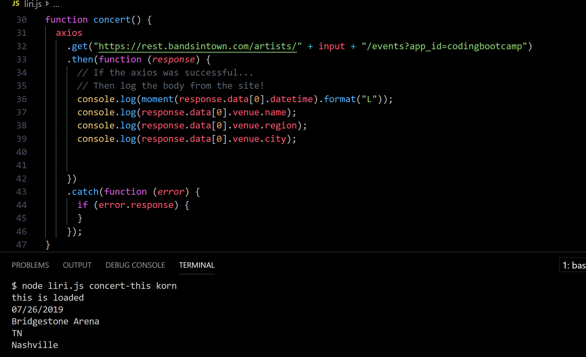
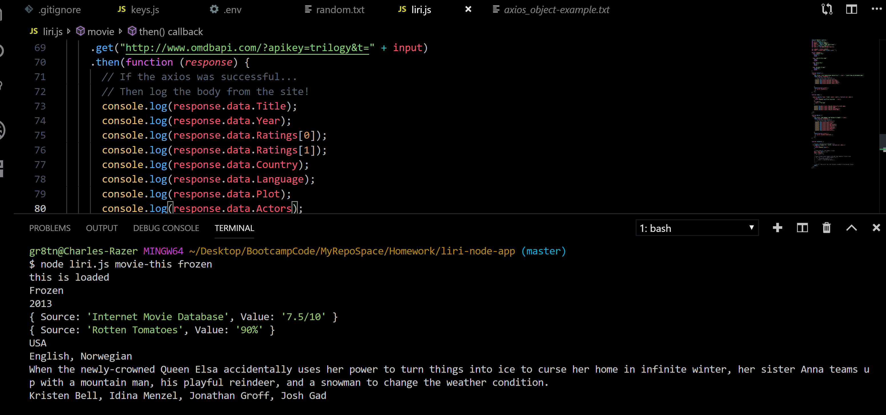

### This is the command:
```concert-this```

### This is the command:
`do-what-it-says`

### There is no input value:
### This is a command:
`movie-this`

### This is the command:
`movie-this`

### There is no input value:
### This is the command:
`spotify-this-song`
hi
### This is the command:
`spotify-this-song`

